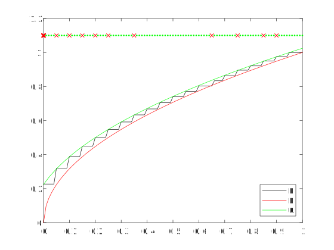
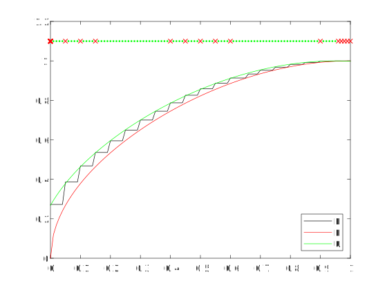

# Karma
Karma stores a list of IDs in a cycle, fulfilling get requests by randomly selecting an ID biasedly in favour of those which have least-recently been cycled. This yields that "things which haven't gone around recently are more likely to come around". The Karma project aims to provide an interface that allows this property to be exploited.

## Including Karma in your Perl project
The source file is available at [src/lib/Karma.pm](./src/lib/Karma.pm?ts=4), and it may be more convenient to copy this file locally rather than installing via CPAN. CPAN installation can be done by downloading src/ and running
```
perl Makefile.PL
make
make test
make install
```

## Motivation
Years ago, I diligently maintained a list of words and meanings in a plaintext file. As I added more and more words to the top of the file, naturally, older words fell out of the short distance haphazard scrolling would be willing to take me. Still, I would add words, for to recognise their significance and write them down *somewhere* would be an act of learning, if only minor. Each addition would bring a slight feeling of perturbation, in turn inciting a few seconds of higher order thought on how I could develop a system to allow efficient revision. The sum of seconds turned to minutes, and minutes to larger denominations of minutes, until I had divined a genius schematic for a system that would allow me to formally revise words.

On 13th July 2017, I patched a small computerised component for this vocabulary system into my personal calendar. Its success was a combination of its genius design and my diligence, and it might serve as a good benchmark that I recount the number of words I had inserted between then and now, over a year later. That I reveal a specific figure is probably needlessly precise, so I'll give looser bounds and let any inferences be out of my hands. More than two, less than four. Yes, singular words. Yes, you can count that high with one hand. No no, I plead, please remember that "the whole is lesser than the sum of its parts", so you musn't place an upper bound on either my intelligence or my ability to design. Oh ... but, howsoever, the unit conversions might work out in my favour. Where there are unknowns, there is infinite hope, now would you be so merciful as to stop thinking.

Though I had proceeded blindly and failed, my eyes had not been shut to other things. I had reached peek cognisance of a profound ability I possess, that, in general, I am very well able to incrementally produce mountains of categorically sorted text which I will rarely look back upon, unless to specifically look something up. Surely, much if this text is just a healthy side effect of learning. To give an idea some tangible form, or to write notes under the if only hypothetical assumption that they must be understood if ever read again -- probably only the journey mattered, and I can find contentment wheresoever they lie. Yet, it is a delicate task to avoid the overextension of this confidence. 

I purport to have learnt vocabulary words merely by having written them down once. I am confident that I have extracted meaning from a quote merely by having copied it down somewhere. I am sure that I have fully explored an idea merely by welcoming it and sending it straight into the abyss. I have sated my interest in a particular piece of maths merely by writing it down and annotating "this is an interesting piece of maths". What goes around ... having went around, never sees the light of day again, and that's all well and good. We seem now to have arrived at the root of the problem, that this is, in fact, not all well and good.

Having being beaten down so thoroughly before, and not having an exact idea of the scope of what I wanted, the aim of Karma was thus decided to capture some equivalence of *what goes around comes around again* in a reasonable order and on demand, and only this -- I definitely wanted this, but wasn't sure about much else. The result is that Karma had been developed in a rather abstract way, devoid of any human interactive layer, highly configurable, and without presumption of what the IDs it stores signify. From the start, it was known that Karma would need a more concrete brother ([KWrap](https://github.com/nick-killeen/kwrap/)) that would use Karma as its core. The purpose of Karma then, summarily, is to be the core of KWrap. And by way of KWrap, it would help solve the piles of plaintext that would grow on my desktop, and the hundreds of calendar reminders that pass me by incomplete for mere incompatibility with my willingness on the day they arrived; to provide a platform that allows the (relatively) effective revision of a broad range of things, on demand.

## Usage
The  [source file](./src/lib/Karma.pm?ts=4) is human readable, and what interface methods there are, what arguments they take, what they do; shouldn't be magnificently obscure. As for under what circumstances I had intended them to be used, that is, how this module is meant to be a part of a larger system, it remains that I make that clear, to the extent that I am able.
Symbolically, the IDs that Karma stores should represent Acts. Given an ID, you should be able to perform a corresponding action, say, the physical act of revising a word with pen and paper. By calling `peek`, you are requesting an Act that Karma has chosen you ought to do, probably since you haven't done it recently. By calling `cycle`, you are indicating that you have performed that Act, so you want it to be sent to the end of the Karmic cycle, where it is least likely to be peeked at again. 

Contiguous peeks will not yield different results, and it might be that an Act gets peeked that you might not wish to do, by some coincidence of circumstances. Do not cycle at such times; cycling should only ever flag the successful completion of a task. Instead, `prime` can be used to recalculate the Act that is in cache, and return it to you. Subsequent peeks will now yield the Act that has just been primed. If you regret knowing what comes next at all, and want it to be recalculated the next time you call peek (probably in a different session), you can `relax` to return to a state where nothing is primed.

Now, in order to actually use Karma in this way, there must be some link between an Act ID and an actually Act, and a runtime interface by which these operations can actually be called. [KWrap](https://github.com/nick-killeen/kwrap/) provides a simple, ready-to-go implementation of these features.

## Tools
The MATLAB script serves to experimentally confirm that L ≤ P ≤ U, that is, that for a bijective biased index generator T: \[0, 1) -> \[0, 1), and its discretisation G(U, n) := floor(T(U) * n) with U ~ Uniform\[0, 1), that for all percentiles p in {0, 1/d, 2/d, ..., 1} for some discretisation interval d in {1, 2, ...}, with a Karmic cycle of integer length n, that T<sup>-1</sup>(p) ≤ P(G(U, n) ≤ p) ≤ T<sup>-1</sup>(p + 1/n);
 
We have lower and upper bounds L and U for P, the probability that G is in the top p-percentile for a Karmic cycle with n Acts. The MATLAB script will generate such images as:

for the default T(x) := x^2:
<p align="center">

</p>

for T(x) := ((1/pi) \* asin(2\*x^2 - 1) + 1/2)^b, with a = 5, b = 0.8:
<p align="center">

</p>


